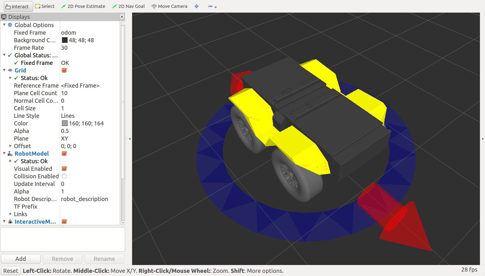

Simulating Grizzly
=========================  

Overview
----------

The Grizzly simulator is implemented using `simulator_gazebo <http://wiki.ros.org/simulator_gazebo>`_ stack. It is a three-dimensional, rigid-body model of the Grizzly with most of the hardware-ROS interfaces found on the actual robot. You can see the source for all Grizzly related software `here <https://github.com/g>`_.

Running the Simulation
------------------------

Starting with a basic ROS install, execute the following in a terminal:

.. code:: bash

	sudo apt-get update
	sudo apt-get install ros-indigo-grizzly-simulator ros-indigo-grizzly-desktop ros-indigo-grizzly-navigation

Open a terminal window, and enter:

.. code:: bash

	roslaunch grizzly_gazebo grizzly_empty_world.launch

Open another terminal window, and enter:

.. code:: bash

	roslaunch grizzly_viz view_robot.launch

The Gazebo window shows the simulation's ground truth, while the `rviz <http://wiki.ros.org/rviz>`_ window shows the robot's perception.

You can click the `Interact <http://wiki.ros.org/interactive_markers>`_ button in rviz, and use the interactive markers to give Grizzly some motion commands:

When you do this, note that the difference between what you observe in Gazebo and rviz:

*  In Gazebo, you're seeing the simulated Grizzly move "for real" through its simulated environment.
*  In rviz, you're observing the output of the `robot_localization <http://wiki.ros.org/robot_localization>`_ node, as it processes simulated encoder and IMU data, and publishes that result as the odom -> base_link `transform <http://wiki.ros.org/tf>`_, which is how rviz positions the model.

If you'd like to command your simulated Grizzly using raw messages, open a third terminal window, and enter:

.. code:: bash

	rostopic pub /cmd_vel geometry_msgs/Twist -r 50 '{ linear: { x: 0.5 } }'

In the above command, we publish to the cmd_vel topic, of topic type ``geometry_msgs/Twist``, at a rate of 50Hz. The data we publish tells the simulated Grizzly to go forwards at 0.5m/s, without any rotation. You should see your Grizzly move forwards. In the gazebo window, you might also notice simulated wheel slip, and skidding.

Known Issues
------------------

*  The robot skids a lot more in simulation than in real life

Report a Bug
------------------

Please flag any found bugs on the `github page <https://github.com/g/grizzly_simulator/issues>`_. 