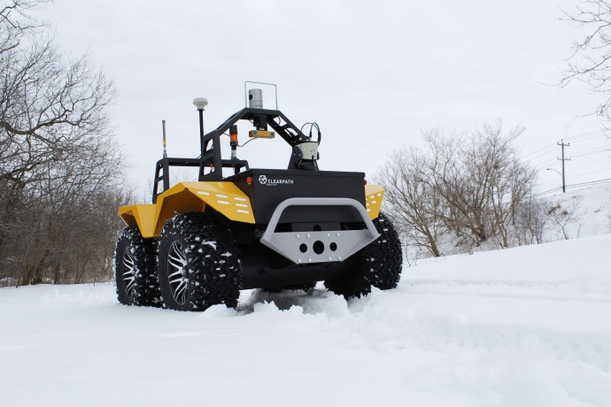

Grizzly RUV Tutorials 
=====================          

    
Grizzly Robotic Utility Vehicle (RUV) is designed for rough, rugged, outdoor environments. With four 26" all-terrain tires, a solid steel chassis, and 48V at 400Ah of power, it's ideal for military, mining an agricultural applications. Grizzly RUV offers incredible strength, an unbeatable control system and front axle articulation that keeps the vehicle grounded and stable on even the most challenging terrain. Combined power and precision is the result of onboard current and voltage sensors, high precision wheel encoders, IMU, GPS, and a maximum drawbar of almost 1700lbf. Grizzly fully supports ROS - all of the packages are available in the `Grizzly github org <https://github.com/g>`_.

For more information or to receive a quote, please `visit us online <http://clearpathrobotics.com/grizzly>`_.

.. Note:: These tutorials assume that you are comfortable with ROS and the catkin build system.  Please familiarize yourself using the `ROS <http://wiki.ros.org/ROS/Tutorials>`_ and `catkin <http://wiki.ros.org/catkin/Tutorials>`_ tutorials. 
 
.. toctree::
    :maxdepth: 0
    :caption: Getting Started

    InstallDesktopPackages.rst
    SimulatingGrizzly.rst
    UpstartInstallation.rst
    SupportingPackages.rst 
    GrizzlyTopics.rst

   
